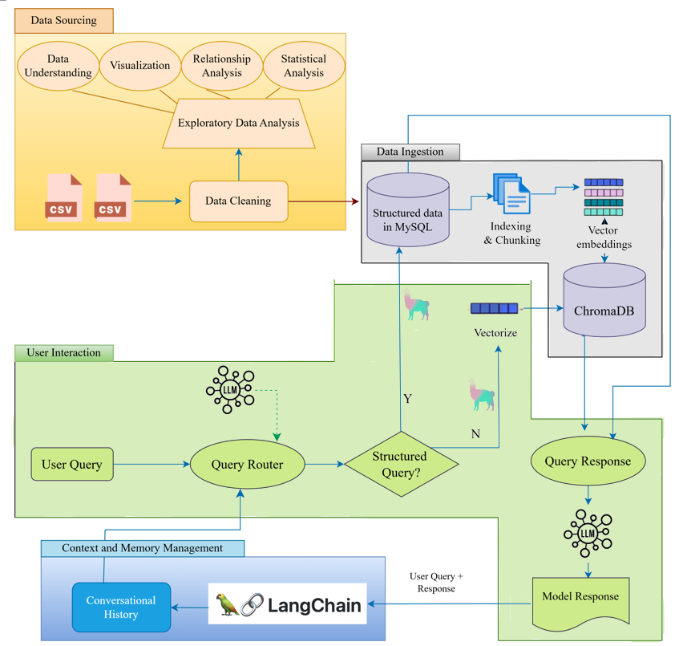

# IPLGuru: Hybrid RAG Assistant for IPL Analytics


> Hybrid Retrieval-Augmented Generation (RAG) assistant that combines SQL-based analytics, semantic search, intelligent query routing, and conversational memory to answer IPL-related questions.

---

## Project Overview

The Indian Premier League (IPL) is one of the world's most popular cricket tournaments, generating massive amounts of structured statistics and unstructured match narratives.

Traditional search systems struggle to effectively answer both:

- Statistical questions
- Contextual and narrative questions

IPLGuru is an AI-powered cricket analytics assistant designed to solve this challenge using a Hybrid Retrieval Architecture.

The system intelligently determines whether a user query should be answered through:

- Structured retrieval from MySQL
- Semantic retrieval from ChromaDB

By integrating OpenAI, LlamaIndex, LangChain, MySQL, and ChromaDB, IPLGuru delivers accurate, context-aware, and conversational responses for IPL-related questions.

---

## Business Problem

IPL data exists in multiple forms.

### Structured Information

Examples:

- Player statistics
- Team performance
- Match scores
- Tournament records

Example Query:

> Who scored the most runs in IPL 2016?

---

### Unstructured Information

Examples:

- Match highlights
- Memorable moments
- Match summaries
- Narrative descriptions

Example Query:

> Tell me the most remarkable moments of IPL 2020.

---

Traditional SQL databases perform exceptionally well for structured analytics but cannot effectively answer semantic or conversational questions.

Conversely, semantic search systems excel at contextual retrieval but are inefficient for precise statistical computations.

The objective of IPLGuru is to build an intelligent assistant capable of dynamically selecting the most appropriate retrieval mechanism based on the user's query.

---

## Project Objectives

1. Build a conversational IPL analytics assistant.
2. Support both structured and unstructured IPL queries.
3. Store IPL statistics in a relational database for SQL retrieval.
4. Create semantic embeddings for contextual IPL knowledge retrieval.
5. Implement intelligent query routing.
6. Support multi-turn conversations using memory.
7. Demonstrate Hybrid RAG architecture using LlamaIndex and LangChain.

---

## Dataset Description

The project utilizes IPL datasets sourced from Kaggle.

### Data Sources

#### matches.csv

Contains:

- Match details
- Teams
- Venue information
- Toss information
- Match winners
- Season information

#### deliveries.csv

Contains:

- Ball-by-ball details
- Runs scored
- Wickets
- Bowlers
- Batters
- Match events

---

## Dataset Processing Pipeline

```text
Raw CSV Files
      │
      ▼
Data Cleaning
      │
      ▼
Exploratory Data Analysis
      │
      ▼
Structured Storage (MySQL)
      │
      ▼
Chunking & Embedding
      │
      ▼
ChromaDB Indexing
```

---

## System Architecture



---

## Why Hybrid RAG?

Traditional RAG systems rely entirely on semantic retrieval.

```text
User Query
      │
      ▼
Vector Search
      │
      ▼
Retrieved Context
      │
      ▼
LLM Response
```

While effective for narrative questions, this approach is inefficient for statistical queries.

For example:

> Which player scored the highest number of sixes in IPL 2019?

This question requires precise aggregation and is best handled using SQL.

IPLGuru combines:

### Structured Retrieval

```text
Natural Language Query
          │
          ▼
SQL Generation
          │
          ▼
MySQL Database
          │
          ▼
Accurate Statistical Answer
```

### Semantic Retrieval

```text
Natural Language Query
          │
          ▼
Embedding Search
          │
          ▼
ChromaDB Retrieval
          │
          ▼
Context-Aware Response
```

This hybrid architecture ensures that every query is answered using the most suitable retrieval strategy.

---

## Core Components

The IPLGuru architecture consists of eight major components:

### 1. Data Ingestion and Cleaning

The IPL dataset is loaded into Pandas DataFrames and cleaned to ensure consistency and reliability.

Key activities include:

- Missing value handling
- Duplicate removal
- Data validation
- Format standardization

---

### 2. Exploratory Data Analysis (EDA)

EDA is performed to understand:

- Data distributions
- Team performance trends
- Player statistics
- Match outcomes
- Relationships between variables

This step ensures data quality before downstream processing.

---

### 3. Structured Data Storage

Cleaned IPL datasets are stored in MySQL.

Benefits:

- Fast analytical querying
- Aggregations
- Filtering
- Statistical computations

MySQL acts as the primary source for structured retrieval.

---

### 4. Semantic Embedding Layer

To support contextual and conversational search, IPL match data is transformed into embeddings.

Embedding Model:

```text
text-embedding-ada-002
```

The embeddings capture semantic relationships between match events, player performances, and match narratives.

---

### 5. Vector Database

Embeddings are stored in:

```text
ChromaDB
```

Benefits:

- Fast similarity search
- Semantic retrieval
- Efficient vector storage
- Scalable search architecture

---

### 6. SQL Search Agent

The SQL Search Agent converts natural language questions into SQL queries using LlamaIndex.

Example:

**User Query**

> Which team won the IPL in 2018?

**Generated SQL**

```sql
SELECT winner
FROM matches
WHERE season = 2018;
```

This enables natural language interaction with relational data.

---

### 7. Vector Search Agent

The Vector Search Agent is responsible for handling unstructured and conversational IPL queries.

Instead of relying on exact keyword matching, it performs semantic retrieval using embeddings stored in ChromaDB.

Example queries:

> Tell me the most exciting moments of IPL 2020.

> Which was the most dramatic final in IPL history?

> Describe Virat Kohli's best IPL season.

For such questions, the system retrieves semantically relevant IPL match summaries and contextual information before generating the final response.

---

### 8. Intelligent Query Router

One of the key innovations of IPLGuru is the Intelligent Query Router.

The router dynamically classifies incoming queries into:

- Structured Queries
- Unstructured Queries

and directs them to the most appropriate retrieval system.

Examples:

| Query | Route |
|---------|---------|
| Who scored the most runs in IPL 2016? | MySQL |
| Which team won IPL 2019? | MySQL |
| Tell me the most memorable IPL final. | ChromaDB |
| Describe Dhoni's greatest IPL moments. | ChromaDB |

The router is implemented using GPT-4 and advanced prompt engineering techniques.

---

## Query Routing Workflow

```text
User Query
      │
      ▼
GPT-Based Query Router
      │
 ┌────┴─────┐
 │          │
 ▼          ▼

Structured  Unstructured

(SQL)       (Semantic Search)

MySQL       ChromaDB

 │            │
 ▼            ▼

Response Generation
      │
      ▼
Final Answer
```

---

## Hybrid Retrieval Strategy

Traditional AI assistants often rely on a single retrieval mechanism.

IPLGuru combines:

### Structured Retrieval

Best suited for:

- Statistical queries
- Aggregations
- Rankings
- Match results

Examples:

- Who scored the highest runs in IPL 2018?
- Which bowler took the most wickets in IPL 2020?
- How many matches did CSK win in IPL 2011?

---

### Semantic Retrieval

Best suited for:

- Narrative questions
- Match highlights
- Contextual discussions
- Player stories

Examples:

- Describe the most exciting IPL final.
- Tell me about Dhoni's memorable IPL performances.
- Which IPL season had the most thrilling matches?

This combination provides both accuracy and flexibility.

---

## Context Retention and Memory Management

A conversational assistant must understand follow-up questions.

Example:

**User**

> Who scored the most runs in IPL 2018?

**Assistant**

> Kane Williamson scored the most runs in IPL 2018.

**User**

> Which team did he play for?

Without memory, the assistant cannot determine who "he" refers to.

IPLGuru uses LangChain memory components to maintain conversational context across interactions.

---

## Conversation Memory Workflow

```text
User Query
      │
      ▼
LangChain Memory
      │
      ▼
Conversation Context
      │
      ▼
Query Router
      │
      ▼
Retrieval Layer
      │
      ▼
Response Generation
      │
      ▼
Memory Update
```

---

## Sample Query Flow

The following example demonstrates how IPLGuru dynamically routes user queries to the most appropriate retrieval mechanism based on query intent.

```text
                      User Query
                           │
                           ▼

                  GPT Query Router

                           │
          ┌────────────────┴────────────────┐
          │                                 │
          ▼                                 ▼

   Structured Query                Unstructured Query

 "Top scorer in IPL 2018"      "Most exciting IPL moments"

          │                                 │
          ▼                                 ▼

  LlamaIndex SQL Agent            ChromaDB Retrieval

          │                                 │

          ▼                                 ▼

       MySQL DB                   Relevant Chunks

          │                                 │

          └──────────────┬──────────────────┘
                         ▼

                GPT Response Generator

                         ▼

                    Final Answer
```

This example illustrates IPLGuru's Hybrid Retrieval Architecture, where:

- Statistical and analytical questions are routed to the SQL retrieval pipeline.
- Contextual and narrative questions are routed to the semantic retrieval pipeline.
- Both retrieval mechanisms are unified through a common response generation layer.
- Users interact through a single conversational interface without needing to know which retrieval strategy is being used internally.

This architecture enables IPLGuru to answer both precise statistical questions and open-ended cricket discussions effectively.

---

## Application Output Samples

The following examples demonstrate IPLGuru's ability to handle structured retrieval, semantic retrieval, conversational memory, and context switching.

📄 **[View Application Output Samples](reports/application_output_samples.md)**

The examples cover:

- Structured SQL-based retrieval
- Follow-up questions using conversational memory
- Semantic retrieval using ChromaDB
- Context-aware responses when conversation topics change

---

## Technical Challenges

### Natural Language to SQL Conversion

One of the biggest challenges was converting user questions into valid SQL statements.

Challenges included:

- Ambiguous column references
- Missing table names
- Complex aggregations
- Multi-table joins

To improve accuracy, schema information was explicitly injected into LlamaIndex prompts.

---

### Query Classification

Some queries contain both structured and unstructured elements.

Example:

> Tell me about the match where Virat Kohli scored his highest IPL score.

This query requires:

- Structured retrieval to identify the match
- Contextual retrieval to describe the match

Designing prompts capable of correctly classifying and routing such queries required careful experimentation.

---

### LlamaIndex Version Changes

LlamaIndex evolves rapidly and frequently introduces:

- API changes
- Class name changes
- Method signature updates

Maintaining compatibility across versions required continuous refactoring and testing.

---

### Embedding Granularity

Choosing the appropriate chunk size was critical.

Options considered:

- Entire Match
- Per Over
- Every 5 Overs

Final Choice:

```text
Chunk every 5 overs
```

This provided the best balance between:

- Context preservation
- Retrieval quality
- Storage efficiency

---

### Context Retention

Maintaining conversation history without excessive memory growth required balancing:

- Context length
- Retrieval accuracy
- Memory efficiency

A limited conversation memory strategy was adopted to retain recent interactions while preventing context explosion.

---

## Key Design Decisions

### Why Hybrid Retrieval?

A pure SQL solution cannot answer narrative questions.

A pure vector search solution cannot efficiently answer statistical queries.

The Hybrid Retrieval Architecture combines the strengths of both approaches.

---

### Why ChromaDB?

ChromaDB was selected because it provides:

- Fast vector similarity search
- Easy integration with LlamaIndex
- Local deployment support
- Lightweight architecture

---

### Why LlamaIndex?

LlamaIndex simplifies:

- SQL Agent creation
- Vector retrieval
- Prompt orchestration
- Retrieval-Augmented Generation workflows

making it well suited for building intelligent data applications.

---

### Why LangChain?

LangChain was used primarily for:

- Conversation memory
- Context retention
- Multi-turn interaction support

This enables more natural user conversations.

---

## Technologies Used

- Python
- OpenAI GPT-4
- LlamaIndex
- LangChain
- ChromaDB
- MySQL
- SQLAlchemy
- Pandas
- NumPy
- OpenAI Embeddings
- Jupyter Notebook

---

## Business Applications

The architecture demonstrated in IPLGuru can be extended to:

- Sports Analytics Platforms
- Financial Research Assistants
- Enterprise Knowledge Assistants
- Customer Support Systems
- Legal Research Applications
- Healthcare Knowledge Systems
- Business Intelligence Platforms

---

## Key Learnings

This project demonstrates practical implementation of:

- Hybrid RAG Architecture
- Semantic Search
- SQL Agents
- Vector Databases
- Query Routing
- Prompt Engineering
- Conversational AI
- Context Retention
- LLM Orchestration

---

## Future Enhancements

### Retrieval Improvements

- Hybrid Search (Keyword + Vector Search)
- Metadata Filtering
- Query Expansion
- Re-ranking Models

### Agentic AI Enhancements

- Multi-Agent Architecture
- Tool Calling
- Dynamic Workflow Selection
- Self-Correcting Query Plans

### Production Deployment

- FastAPI Backend
- Streamlit UI
- User Feedback Analytics
- Monitoring Dashboard
- Response Quality Evaluation Framework

---

## Repository Structure

```text
iplguru-hybrid-rag-assistant/
│
├── README.md
├── requirements.txt
├── .gitignore
│
├── data/
│   ├── matches.csv
│   └── deliveries.csv
│
├── notebooks/
│   └── IPLGuru.ipynb
│
├── reports/
│   └── figures/
│       ├── system_architecture.png
│       └── sample_query_flow.png
│
└── src/
```

---

## How to Run

### Clone Repository

```bash
git clone https://github.com/rajani2024/iplguru-hybrid-rag-assistant.git
```

### Navigate to Project Directory

```bash
cd iplguru-hybrid-rag-assistant
```

### Install Dependencies

```bash
pip install -r requirements.txt
```

### Configure Environment Variables

Create a `.env` file:

```env
OPENAI_API_KEY=your_api_key_here
```

### Configure MySQL

Update database connection settings:

```python
MYSQL_HOST=localhost
MYSQL_USER=root
MYSQL_PASSWORD=your_password
MYSQL_DATABASE=iplguru
```

### Launch Notebook

```bash
jupyter notebook notebooks/IPLGuru.ipynb
```

---

## Author

This project was completed as part of an advanced Generative AI learning journey focused on:

- Retrieval-Augmented Generation (RAG)
- Hybrid Retrieval Systems
- LlamaIndex
- LangChain
- Vector Databases
- SQL Agents
- Conversational AI
- Intelligent Query Routing

The project demonstrates how structured analytics and semantic search can be combined into a unified AI assistant capable of answering both statistical and contextual questions through natural language interactions.
